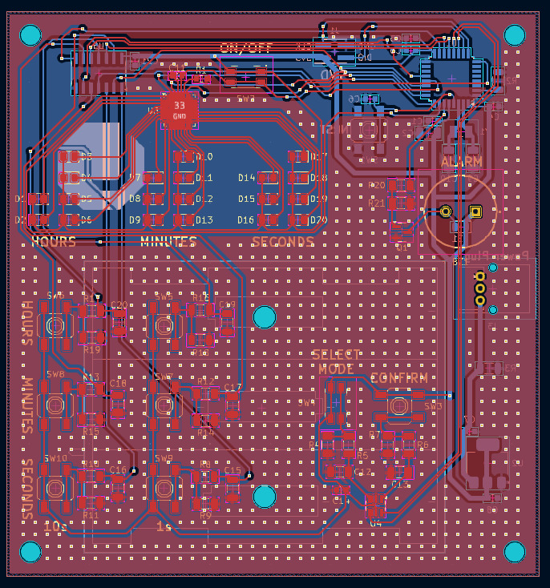
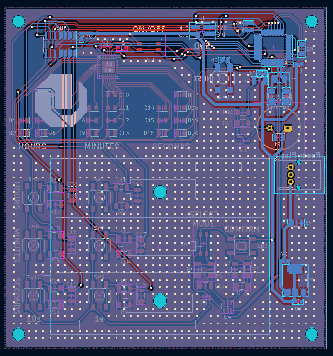
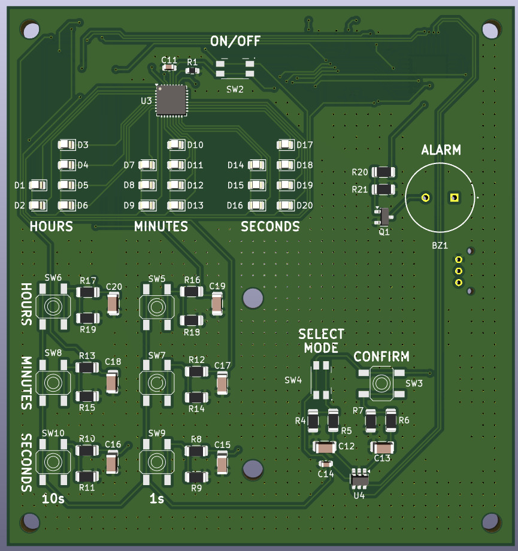
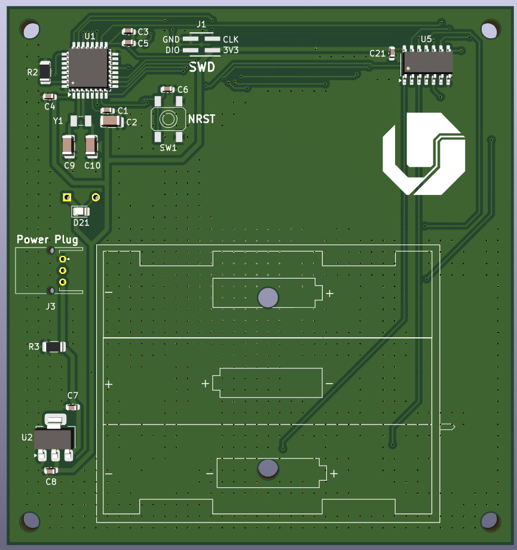

# EmbeddedSTM32-BinaryClock

## Contributors

- Arthur Henrique Ferraz Netto

- João Pedro Cavalcante Albuquerque Costa

- Pedro Henrique Fujinami Nishida

## Overview
**EmbeddedSTM32-BinaryClock** is a project that demonstrates how to create a binary clock using an STM32 microcontroller. The project is written primarily in C and uses a Makefile for the build process. The binary clock displays the current time in binary format using LEDs, providing a unique and educational way to visualize time.

## Features
- **Binary Time Display**: Displays hours, minutes, and seconds in binary format using LEDs.
- **STM32 Microcontroller**: Utilizes an STM32 microcontroller for precise timing and control.
- **Efficient Codebase**: Simple, well-structured, and easy-to-understand code.
- **Custom PCB**: Includes a custom-designed PCB for a clean and professional build.

## Photos
Below are photos of the custom PCB and the assembled project:

### 2D
  
*Front view of the custom PCB.*

  
*Back view of the custom PCB.*

### 3D



  

## Getting Started

### Prerequisites
To build and flash this project, you will need the following:
- **STM32 Development Board** (e.g., STM32F4Discovery)
- **STM32CubeIDE** or any other STM32 development environment
- **Make Utility**
- **ARM GCC Compiler**
- **Flashing Tool** (e.g., ST-Link, OpenOCD)

### Installation
1. Clone the repository:
   ```sh
   git clone https://github.com/pedro-nishida/EmbeddedSTM32-BinaryClock.git
   cd EmbeddedSTM32-BinaryClock
   ```
2. Build the project using the provided Makefile:
   ```sh
   make
   ```
3. Flash the binary to your STM32 board using your preferred flashing tool.

### Usage
1. Connect the LEDs to the appropriate GPIO pins on the STM32 board as defined in the code.
2. Power up the STM32 board.
3. The LEDs will display the current time in binary format.

## Project Structure
```
EmbeddedSTM32-BinaryClock/
├── src/                # Contains the source code files.
├── include/            # Contains the header files.
├── photos/             # Contains photos of the PCB and assembled project.
├── Makefile            # Build script for the project.
├── LICENSE             # License file.
└── README.md           # This README file.
```

## Contributing
Contributions are welcome! If you'd like to contribute, please follow these steps:
1. Fork the repository.
2. Create a new branch for your feature or bugfix.
3. Commit your changes.
4. Submit a pull request with a detailed description of your changes.

## License
This project is licensed under the **MIT License**. See the [LICENSE](LICENSE) file for details.

## Acknowledgments
- Thanks to the **STM32 community** for their support and resources.
- Special thanks to everyone who contributed to the development of this project.

---

Feel free to modify this README as needed. If you have any questions or suggestions, please open an issue or contact the repository owner. Enjoy your binary clock! 🎉
